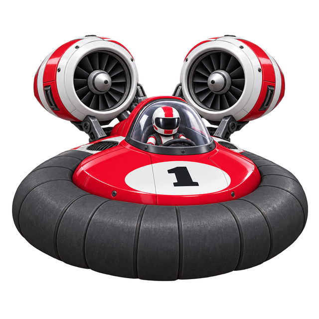

<p align="center">
  
</p>

<h1 align="center">HOVERNET</h1>

<p align="center"><b>Fast hovercraft. Tight tracks. Missiles. Race the world.</b></p>

<p align="center">
  <a href="../../releases"><b>&#9654; GET THE GAME</b></a> &nbsp;&middot;&nbsp;
  <a href="#-quick-start">Quick start</a> &nbsp;&middot;&nbsp;
  <a href="#-controls">Controls</a> &nbsp;&middot;&nbsp;
  <a href="#-choose-your-track">Tracks</a> &nbsp;&middot;&nbsp;
  <a href="#-race-online">Online</a> &nbsp;&middot;&nbsp;
  <a href="#-need-help">Help</a>
</p>

---

> ### &#127937; HOVERNET 2.0 IS OUT
> Grab it from the [Releases page](../../releases). It is the one marked **Latest**.
> **We still want your feedback.** Found a bug, or have an idea? [Open an issue](../../issues).
> It takes a minute and helps a lot.

**HoverNet is a fast-paced hovercraft racing game.** Pick a track, floor it, hop the
ramps, and blast your rivals with missiles on the way round. It is a modern remake of
the classic **HoverRace** (GrokkSoft, 1996) that runs on **Windows and Linux** and lets
you race other players **online**.

```
  +--------------------------------------------------------------+
  |  RACE 0:42.10                                      LAP 2 / 3 |
  |                                                              |
  |                     ( >>> GO GO GO <<< )                     |
  |                                                              |
  |   SPEED  |||||||||||.....     FUEL  ||||||||||||||..         |
  |   Missile ready                                              |
  +--------------------------------------------------------------+
```

## &#127918; Quick start

**1. Download it** from the [Releases page](../../releases):

| You have | Download | Then |
| --- | --- | --- |
| **Windows (64-bit)**, recommended | `HoverNet-<version>-windows-x64-setup.exe` | double-click it and press Next |
| **Linux** (Ubuntu, Debian) | `hovernet-game_<version>_amd64.deb` | `sudo apt install ./hovernet-game_*.deb`, then run `hovernet` |
| **Windows (32-bit)** or an older PC | `HoverNet-<version>-win32-setup.exe` | the classic version, kept for compatibility |

**2. Press START.** The first time, a short tutorial shows you the controls.

**3. Pick a mode.**

| Mode | What it is |
| --- | --- |
| **Local Play** | Race on your own. Choose a track, how many laps, and weapons on or off. |
| **Online Lobby** | See open races, host your own, join friends, and chat while you wait. |

That is all there is to it. No accounts, no setup, no extra downloads to start.

## &#127918; Controls

You can change every key in **Settings**, and game controllers work too.

| Input | Action |
| --- | --- |
| **Left / Right Shift** | Accelerate |
| **Left / Right** | Steer (and pick your hovercraft during the countdown) |
| **Up** | Jump |
| **Down** | Brake / reverse |
| **Left / Right Ctrl** | Fire a missile |
| **Tab** | Change weapon |
| **F3** / **F4** | Following camera / cockpit camera |
| **Esc** | Pause menu (leave the race or quit) |

> **Tip:** jump the gaps and water, grab the power-ups, keep an eye on your fuel gauge,
> and save your missiles for the straights.

## &#127937; Choose your track

Seven **official tracks** come with the game:

| Track | Style | Level |
| --- | --- | --- |
| **ClassicH** | The classic all-round circuit. Start here. | Beginner |
| **Steeplechase** | Obstacles and controlled jumps | Intermediate |
| **Switchback** | A long, twisting route | Intermediate |
| **The River** | Fast and flowing, along the water | Intermediate |
| **Tidal Causeway** | Broad tidal circuit, chicanes and twin jumps | Intermediate |
| **The Alley2** | Tight corridors for quick reactions | Advanced |
| **Metro Spiral** | Rotated skyline with rapid direction changes | Advanced |

### &#127757; And about a thousand more

HoverNet can also play about **1,000 community-made tracks** from the classic HoverRace
library: races, battle arenas, tag, hockey, and some stranger things.

- Open the track list in **Local Play** or **Host race**. The community tracks are
  below the official ones, and there is a **search box**.
- Pick one and press **Download & Start Race**. HoverNet fetches just that track
  (usually under a megabyte), checks it, and drops you in.
- Tracks marked **free play** have no finish line: no laps, just drive, fight and
  explore for as long as you like.
- Want them all? Press **Download all community tracks** in Local Play (about 150 MB).

<details>
<summary><b>Community track details</b></summary>

- You need an internet connection, plus `curl` (or `wget`) on Linux. Windows 10 and
  later already have it. If it is missing the game tells you what to install:
  `sudo apt install curl`.
- Tracks are saved in `~/.config/hovernet/CommunityTracks` (Linux) or
  `%APPDATA%\HoverNet\CommunityTracks` (Windows). Delete files there to free space.
- From a terminal: `hovernet --download-community-tracks --all`.
- No internet? Install the offline pack. See [Community tracks](docs/community-tracks.md).
- These tracks were made by many people over many years and are played exactly as
  published, so some are rough or start you facing a wall. That is part of the fun.

</details>

## &#127760; Race online

1. Choose **Online Lobby** from the main menu. The first time, pick a **username**.
2. You will see **open races** and **who is in the lobby**.
3. **Join** a race that is waiting, or **Host** your own: pick the track, laps and
   weapons, then press **Create Race**.
4. **Chat** while you wait, then the host presses **Start**.

Windows and Linux players can race **together** in the same race. If someone picks a
community track you do not have, press **Download & Join** and the game fetches it for you.

Want your own server? Install the `hovernet-raceserver` package (Linux) or use the
`hovernet-raceserver_*_win32.zip` (Windows), then point **Settings** at it.

## &#10067; Need help?

| Problem | Try this |
| --- | --- |
| **Can't connect to the lobby** | Check your internet connection. If the server is down, host your own (see above) or play **Local Play**. |
| **"Could not download" a community track** | You need internet, and `curl` or `wget` on Linux. The message tells you what is missing. |
| **The window is too small or too big** | **Settings** has display mode, resolution and UI scale. |
| **I can't read the text** | **Settings** also has high contrast, large HUD text and reduced motion. |
| **Controls feel wrong** | Remap everything in **Settings**, or plug in a controller. |
| **I found a bug** | [Open an issue](../../issues) and tell us your version, your system, and what you did. |

Your settings are kept when you update or uninstall, so you can safely try a new version.

## &#127793; Also in the works: OpenHover

HoverNet keeps the classic HoverRace game alive. I'm also working on a **fully open
clone** of the game, built from scratch with original code and assets, so that nobody
needs a special licence to play, fork or build on it.

**[OpenHover](https://github.com/johnsie/OpenHover)** is an independent, clean-room
hovercraft racer in C++ with SDL2 and OpenGL. It is dual-licensed MIT / Apache-2.0
(assets CC BY 4.0), and it is still early: you can already drive a hovercraft around a
3D arena with lap timing and checkpoints. HoverNet and OpenHover are separate projects,
and OpenHover does not reuse any HoverRace code or assets.

## &#128295; For developers and server operators

- Build from source, CI and the race server: [technical overview](docs/technical.md)
- Making tracks: [track authoring guide](docs/track-authoring.md)
- Release history: [changelog](CHANGELOG.md), and how releases work: [releasing](docs/releasing.md)
- Joining the beta: [beta test plan](docs/beta-test-plan.md)
- Third-party code and licences: [notices](THIRD_PARTY_NOTICES.md)

---

<p align="center"><i>HoverNet is based on <b>HoverRace</b> by GrokkSoft (1996). See you on the track!</i></p>
